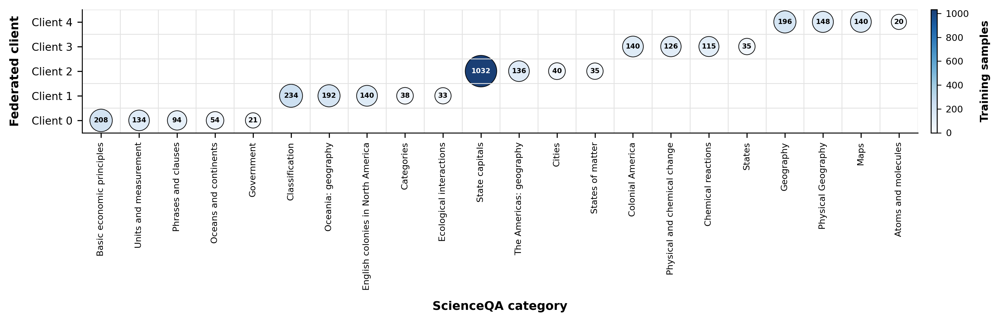
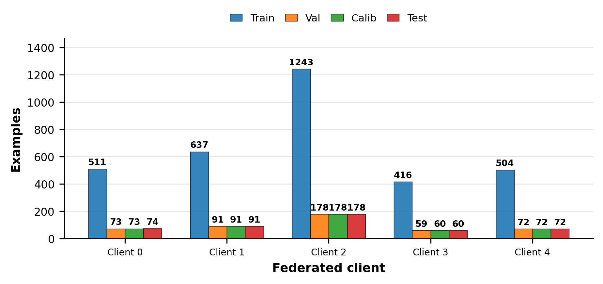
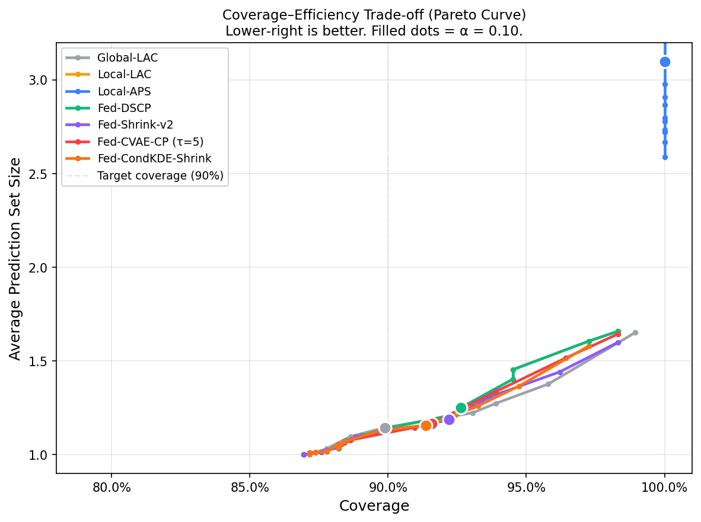
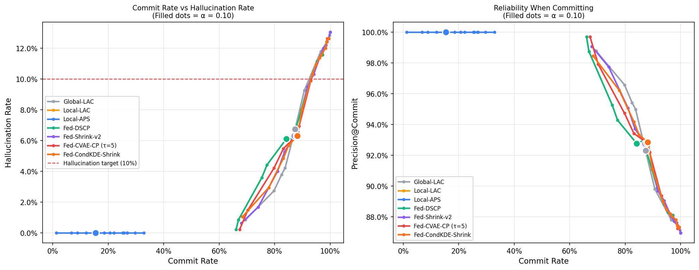
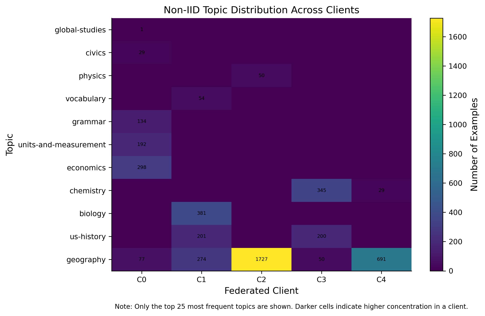
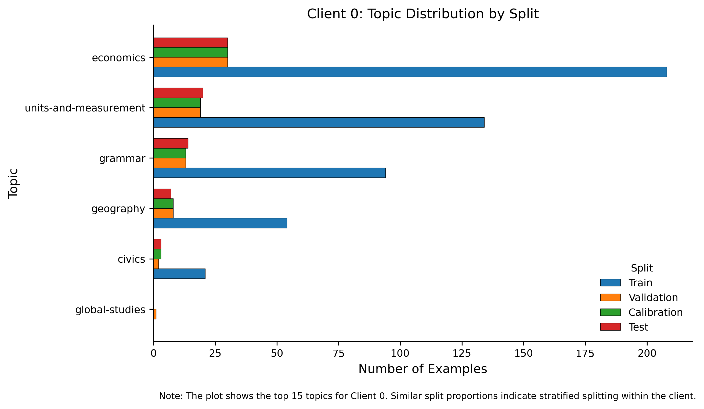
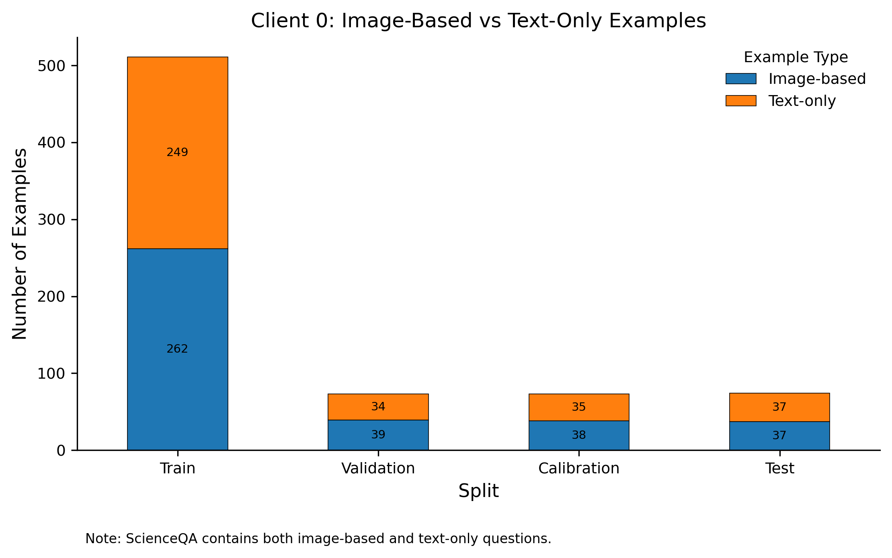
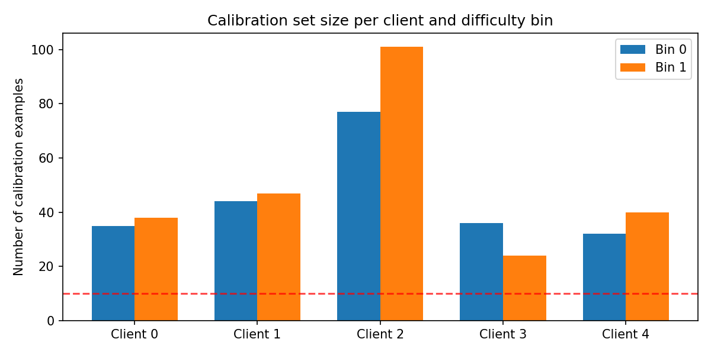
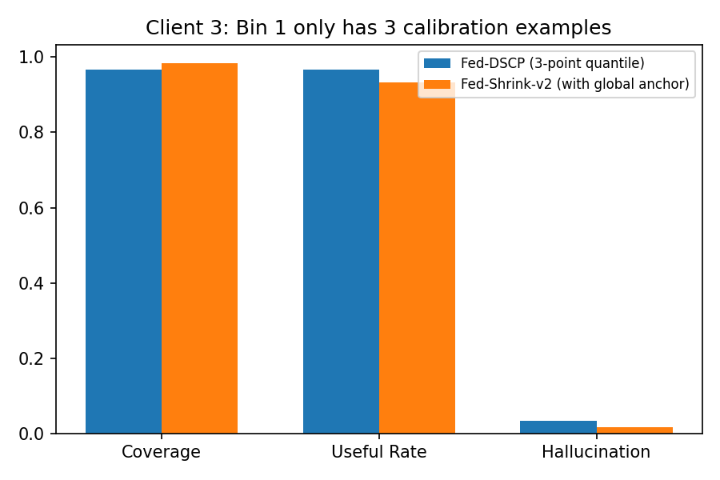
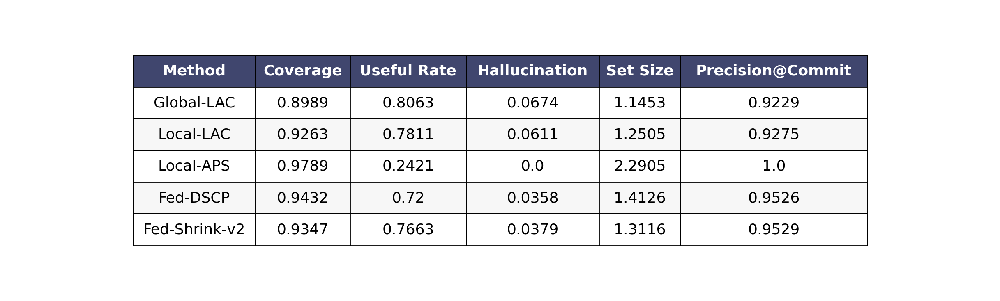

# Fed-DSCP & Fed-Shrink-v2

Federated, Difficulty-Stratified Conformal Prediction for Vision-Language MCQ
on the ScienceQA dataset, fine-tuned on top of `Qwen/Qwen2.5-VL-3B-Instruct`
with LoRA via the Flower simulation framework.

This repository contains the full pipeline used to produce the paper results:
the non-IID client partitioning, the federated LoRA training loop, the
per-example scoring stage, the conformal-prediction methods
(Global-LAC / Local-LAC / Local-APS / **Fed-DSCP** / **Fed-Shrink-v2** /
Fed-CVAE-CP / Fed-CondKDE-Shrink), the ablation study, and every
publication-quality figure (Pareto coverage–efficiency curve, non-IID
bubble matrix, calibration bin-size plot, tiny-bin demo, etc.).


*Headline result on the ScienceQA test split (475 examples, α = 0.10).
**Fed-Shrink-v2** keeps coverage at the conformal target, beats Fed-DSCP
on Useful Rate, and crushes the no-CP hallucination rate by ~3.4×.*

---

## 1. Repository layout

```
.
├── split.py                              # Build 5 non-IID clients from ScienceQA
├── train.py                              # Federated LoRA fine-tuning (Flower + Ray)
├── score_client_data.py                  # Score val/calib/test with the federated adapter
├── conformal_prediction.py               # Main result table (Fed-DSCP, Fed-Shrink-v2, Fed-CVAE-CP)
├── benchmarking.py                       # Weighted result table with per-bin assignment
├── eg.py                                 # Alternate version of the result-table figure
├── ablation.py                           # Ablation over CVAE / KDE / shrinkage τ
├── plot_tradeoff.py                      # α-sweep, Pareto curves, trade-off plots
├── nocpvscp.py                           # No-CP vs Fed-Shrink-v2 per-client table
├── baseline_without_fcp_hallucination.py # Pure top-1 hallucination baseline
├── show_bin_size.py                      # Calibration bin-size diagnostic plot
├── tinybindemo.py                        # Tiny-bin (3-point) shrinkage demo
├── eda.py                                # Topic / image-text EDA plots
├── t.py                                  # Pareto bubble matrix & grouped split bars
├── scienceqa_sft_clients_with_images/    # Output of split.py (5 client folders)
├── flower_qwen_lora_outputs/             # Output of train.py (LoRA adapters)
├── eda_paper_plots/                      # Output of eda.py
├── final_partition_figures/              # Output of t.py
├── fed_dscp_scored_examples.csv          # Output of score_client_data.py
├── main_result.csv                       # Output of conformal_prediction.py
├── ablation_result.csv                   # Output of ablation.py
├── pareto_curves.csv / tradeoff_sweep.csv# Output of plot_tradeoff.py
└── *.pdf / *.png                         # All paper figures and tables
```

---

## 2. Installation with `uv`

The whole project is a pure Python project; we use [`uv`](https://github.com/astral-sh/uv)
both as the package installer and as the runner. `uv` is required because the
Flower / Ray simulation in `train.py` is launched with `uv run --no-project`
and the script even references the `RAY_RUNTIME_ENV_HOOK` that `uv` injects.

### 2.1 Install `uv`

```bash
# macOS / Linux
curl -LsSf https://astral.sh/uv/install.sh | sh

# Windows (PowerShell)
powershell -ExecutionPolicy ByPass -c "irm https://astral.sh/uv/install.ps1 | iex"
```

### 2.2 Create a virtual environment

```bash
cd "project_repo_without_lora_adapters (1)"
uv venv --python 3.10
source .venv/bin/activate          # Windows: .venv\Scripts\activate
```

### 2.3 Install dependencies

The exact dependency set is inferred from the imports in every script.
Install everything in one shot with `uv pip install`:

```bash
uv pip install \
  "torch>=2.2" "torchvision" "torchaudio" \
  "transformers>=4.45" "accelerate" "peft" "bitsandbytes" \
  "qwen-vl-utils" "pillow" \
  "datasets" "scikit-learn" \
  "flwr[simulation]>=1.13" "ray[default]" \
  "numpy" "pandas" "matplotlib" "tqdm"
```

For CUDA users, install the matching PyTorch build first, e.g.:

```bash
uv pip install --index-url https://download.pytorch.org/whl/cu121 \
    torch torchvision torchaudio
```

### 2.4 Hardware

`train.py` auto-selects every NVIDIA GPU with at least `MIN_FREE_GPU_GB = 20 GB`
free (via `nvidia-smi`). At least one such GPU is required because Qwen2.5-VL-3B
is loaded in 4-bit precision with LoRA adapters during the simulation. The
post-training scoring (`score_client_data.py`) and all CP scripts also expect a
GPU when available but fall back to CPU automatically.

---

## 3. The data: 5 non-IID federated clients

`split.py` filters ScienceQA to the 4-choice closed-choice MCQ subset, drops
categories with fewer than `ceil(20 / 0.7) = 29` total examples, then assigns
**whole categories** to clients round-robin (so the partitioning is genuinely
non-IID at the category level). Each client is then split internally,
**stratified by category**, into the four subsets below.



*Pareto bubble matrix of the federated training set. Each bubble is one
(category × client) cell; bubble size and color encode the number of
training examples. The whole-category round-robin assignment makes the
matrix sparse and obviously non-IID — most categories live with exactly
one client.*



*Per-client split sizes. Client 2 is the largest (1,243 train rows),
Client 3 the smallest (416 train rows) — the latter is what motivates
the Fed-Shrink-v2 estimator in §6.2.*

### 3.1 Per-split sizes (from `eda_paper_plots/table_split_sizes_by_client.csv`)

| Client | Train | Validation | Calibration | Test | Total |
|:------:|------:|-----------:|------------:|-----:|------:|
| 0      | 511   | 73         | 73          | 74   | 731   |
| 1      | 637   | 91         | 91          | 91   | 910   |
| 2      | 1,243 | 178        | 178         | 178  | 1,777 |
| 3      | 416   | 59         | 60          | 60   | 595   |
| 4      | 504   | 72         | 72          | 72   | 720   |
| **Total** | **3,311** | **473** | **474** | **475** | **4,733** |

### 3.2 What each split is used for

| Split           | Used by                                     | Purpose |
|-----------------|---------------------------------------------|---------|
| **Train**       | `train.py`                                  | Federated LoRA fine-tuning of Qwen2.5-VL-3B on each client. The local SFT loop runs `LOCAL_EPOCHS=1` with `MAX_LOCAL_STEPS=80` per round for `NUM_ROUNDS=10` rounds, aggregated server-side with FedAvg. |
| **Validation**  | `train.py` (eval), `conformal_prediction.py`, `plot_tradeoff.py`, `eg.py`, `show_bin_size.py` | (a) Round-by-round evaluation loss during federated training. (b) Difficulty bin-edge estimation: each client's validation entropy is split at the median to define the two DSCP bins (`bin 0` = easy, `bin 1` = hard). (c) Conditioning input for the CVAE / KDE quantile generators. |
| **Calibration** | `conformal_prediction.py`, `benchmarking.py`, `ablation.py`, `plot_tradeoff.py`, `nocpvscp.py`, `show_bin_size.py` | Held-out, unseen-during-training data on which the conformal quantile q̂ is computed. Per-method this is global, per-client, or per-(client, bin). The shrinkage estimators in Fed-Shrink-v2 / Fed-CVAE-CP also use the calibration counts `n` to compute λ = n / (n + τ). |
| **Test**        | `conformal_prediction.py`, `benchmarking.py`, `ablation.py`, `plot_tradeoff.py`, `nocpvscp.py`, `baseline_without_fcp_hallucination.py`, `tinybindemo.py` | Final, never-seen evaluation. All reported metrics — coverage, set size, commit rate, hallucination rate, useful rate, precision@commit — are computed on the test split. |

The four subsets per client are stored as JSON-Lines under
`scienceqa_sft_clients_with_images/client_{0..4}/{train,validation,calibration,test}.jsonl`,
each row in OpenAI-style chat format with an optional image path.

---

## 4. End-to-end reproduction (run in this order)

Every script is meant to be run from the repository root with `uv`. The
ScienceQA dataset is downloaded automatically by `datasets.load_dataset` the
first time `split.py` runs.

### Step 1 — Build the federated dataset

```bash
uv run python split.py
```

Outputs `scienceqa_sft_clients_with_images/` (≈4.7 k examples, 5 clients,
images extracted to PNG).

### Step 2 — Federated LoRA fine-tuning

```bash
uv run --no-project python train.py
```

The `--no-project` flag is required: `train.py` explicitly clears
`RAY_RUNTIME_ENV_HOOK` and `UV_PROJECT_ENVIRONMENT` so that Ray's worker
processes are not re-injected with `uv`'s runtime hooks (which would crash the
Flower backend with `TypeError: ray.init() got multiple values for keyword
argument 'runtime_env'`).

This produces `flower_qwen_lora_outputs/federated_adapter_final/` (the
aggregated LoRA adapter), per-round NumPy snapshots
`global_lora_round_{1..10}.npz`, and per-client local adapters under
`flower_qwen_lora_outputs/local_adapters/client_{0..4}/round_{1..10}/`.

Hyper-parameters in the script: `LORA_R=8`, `LORA_ALPHA=16`, `LORA_DROPOUT=0.05`,
4-bit NF4 quantization with double-quant, `LEARNING_RATE=2e-4`,
`GRAD_ACCUM_STEPS=4`, `LOCAL_BATCH_SIZE=1`, gradient checkpointing on.

### Step 3 — Score val / calibration / test with the federated adapter

```bash
uv run python score_client_data.py
```

Loads the base model + the final LoRA adapter, runs a single forward pass per
example, and stores 4-choice token-level logits/probabilities together with
the four uncertainty features used downstream:

* `entropy = -Σ p log p`
* `max_prob = max p`
* `margin = p₍₁₎ − p₍₂₎`
* `energy = -log Σ exp(z)`

plus the LAC score `score_correct = 1 − p(gold)`. Output:
`fed_dscp_scored_examples.csv` (every val/calib/test row across all 5 clients).

### Step 4 — Main result table (Fed-DSCP and Fed-Shrink-v2)

This is the step that produces the headline numbers for **Fed-DSCP** and
**Fed-Shrink-v2**.

```bash
# Re-derives bin edges from validation, computes per-method q̂ on calibration,
# evaluates LAC sets on the test split, writes main_result.csv.
uv run python conformal_prediction.py

# Same evaluation but with the bin column recomputed at runtime; emits the
# styled "final_weighted_table.{pdf,png}" used in the paper.
uv run python benchmarking.py
```

Methods evaluated:

* **Global-LAC** — single q̂ from the union of all clients' calibration scores.
* **Local-LAC** — one q̂ per client from its own calibration scores.
* **Local-APS** — adaptive prediction sets per client.
* **Fed-DSCP** — *per-(client, difficulty bin)* q̂. Bins are defined by
  splitting each client's validation entropy at the median; calibration scores
  are then bucketed into bin 0 / bin 1. Bins with `< MIN_CALIB_PER_BIN = 10`
  fall back to the local LAC quantile.
* **Fed-Shrink-v2** — convex combination of the per-(client, bin) DSCP
  quantile with a *global* per-bin quantile (across all clients):
  `q̂_shrinkv2(c, b) = λ · q̂_DSCP(c, b) + (1 − λ) · q̂_global_bin(b)`,
  where `λ = n / (n + τ)`, `τ = TAU_V2 = 20`, and `n` is the per-(client, bin)
  calibration count. This is the regularizer that fixes Fed-DSCP's variance
  problem when a client × bin cell has very few calibration points.
* **Fed-CVAE-CP (τ=5)** — augments calibration scores with samples from a
  conditional VAE (`CVAE_EPOCHS=300`, `LATENT_DIM=4`,
  `AUGMENT_SIZE=200`), then shrinks toward DSCP with `τ = TAU_SHRINK = 5`.

The five core metrics (printed and written to `main_result.csv`):
*Coverage*, *Useful Rate*, *Hallucination Rate*, *Avg Set Size*, *Precision@Commit*.

### Step 5 — Ablation over CVAE / KDE / shrinkage τ

```bash
uv run python ablation.py
```

Sweeps `τ ∈ {1, 5, 10, 20}` for CVAE-shrunk quantiles and additionally
evaluates `Fed-CondKDE` and `Fed-CondKDE-Shrink`. Writes `ablation_result.csv`.

### Step 6 — α-sweep, Pareto curves, trade-off plots

```bash
uv run python plot_tradeoff.py
```

Sweeps `α ∈ {0.02, 0.04, …, 0.28}` and produces:

* `tradeoff_sweep.csv` — commit / hallucination / precision per (α, method).
* `pareto_curves.csv` — coverage and avg set-size per (α, method).
* `pareto_coverage_setsize.{pdf,png}` — **the Pareto curve plot**
  (coverage vs avg set size, lower-right is better; α = 0.10 highlighted).
* `tradeoff_commit_hallucination.{pdf,png}` — commit-rate vs hallucination-rate.

### Step 7 — Diagnostics & secondary tables

```bash
uv run python nocpvscp.py                       # No-CP vs Fed-Shrink-v2 per client
uv run python baseline_without_fcp_hallucination.py  # Top-1 hallucination baseline
uv run python show_bin_size.py                  # calibration_bin_sizes.{pdf,png}
uv run python tinybindemo.py                    # tiny_bin_demo_final.{pdf,png}
```

### Step 8 — EDA / dataset figures

```bash
uv run python eda.py    # outputs to eda_paper_plots/
uv run python t.py      # outputs to final_partition_figures/
```

---

## 5. EDA / data-distribution figures

### 5.1 Pareto **bubble** matrix of train distribution — `t.py`

`t.py` reads every `client_*/train.jsonl`, groups by `(client, category)`, and
draws a *rotated non-IID bubble matrix*: bubbles sit on a (category × client)
grid, bubble area encodes the number of training samples, and bubble color
(Blues colormap) encodes the same count. Bubble size uses
`60 + 500 · sqrt(count / max_count)` to keep dynamic range readable, and counts
are annotated inside each bubble.

* Code: `t.py`, "FIGURE 1: GROUPED CATEGORY BUBBLE MATRIX" section
  (lines 86–194).
* Output: `final_partition_figures/fig1_rotated_noniid_bubble_matrix.{pdf,png}`.

The same script also produces the grouped-bar split-size figure
`final_partition_figures/fig2_grouped_client_split_sizes_clean.{pdf,png}`
(Train / Val / Calib / Test bars side-by-side per client).

### 5.2 Pareto **coverage–efficiency** curve — `plot_tradeoff.py`

Produced after the α-sweep (Step 6). Coverage is on the x-axis, average
prediction-set size on the y-axis; one curve per CP method, with the α = 0.10
operating point highlighted as a filled circle and the 90 % coverage target
drawn as a dashed vertical line.



*Pareto coverage–efficiency trade-off. Lower-right is better — high
coverage at small set size. **Fed-Shrink-v2** and **Fed-CVAE-CP (τ=5)**
sit on the Pareto frontier; Local-APS achieves perfect coverage only by
collapsing to ~3-element sets.*



*Reliability sweep. Left panel: as commit rate rises, hallucination
rises too — the federated methods stay below the 10 % target line for
longer. Right panel: precision@commit, the trust metric, holds above
0.92 across the operating range for Fed-DSCP / Fed-Shrink-v2 /
Fed-CVAE-CP.*

* Code: `plot_tradeoff.py`, "Plot 2: Coverage vs Set Size (Pareto curve)"
  block (lines 352–378).
* Output: `pareto_coverage_setsize.{pdf,png}`,
  numerical CSV `pareto_curves.csv`.

### 5.3 Topic and image/text distribution — `eda.py`

`eda.py` produces the per-paper EDA figures:

* `fig1_split_size_per_client.{pdf,png}` — bar chart of train/val/calib/test
  size per client.
* `fig2_client_vs_topic_matrix.{pdf,png}` — heatmap of the top-25 topics
  across clients (the non-IID at the topic level).
* `fig3_client_{0..4}_topic_distribution_by_split.{pdf,png}` — within-client
  topic distribution by split (sanity check that splits are stratified).
* `fig4_client_{0..4}_image_text_distribution.{pdf,png}` — image-based vs
  text-only proportions across splits.
* `table_split_sizes_by_client.csv`, `table_topic_counts_by_client_split.csv`.



*Top-25 topics × federated clients. Almost every topic concentrates in a
single client — confirmation that the round-robin partitioning produced
strongly non-IID data.*



*Within-client stratification check (Client 0). Every topic preserves
similar Train / Val / Calib / Test proportions, which is what allows
calibration scores to generalise to the test split.*



*ScienceQA contains both image-based and text-only questions; the
proportions are preserved per split so the model is exposed to both
modalities at every stage.*

### 5.4 Calibration bin sizes — `show_bin_size.py`

Bar chart of calibration counts per (client, difficulty bin) with the
`MIN_CALIB = 10` safety threshold. Bins below the threshold are flagged in red.
Output: `calibration_bin_sizes.{pdf,png}`. This figure motivates Fed-Shrink-v2
because Client 3 / Bin 1 in particular has very few calibration points.



*Per-(client, difficulty bin) calibration counts. The dashed red line is
the `MIN_CALIB = 10` safety threshold below which the empirical
quantile is unreliable — Client 3 / Bin 1 is the cell that motivates
shrinkage.*

### 5.5 Tiny-bin demonstration — `tinybindemo.py`

Synthetic stress test: artificially keeps only `KEEP = 3` calibration points
in Client 3 / Bin 1 and shows that Fed-DSCP's q̂ becomes unstable while
Fed-Shrink-v2's shrunken q̂ remains well-behaved on the same test set.
Output: `tiny_bin_demo_final.{pdf,png}`.



*With only 3 calibration points in Client 3 / Bin 1, naive Fed-DSCP
(blue) hallucinates more and under-covers; **Fed-Shrink-v2** (orange)
borrows strength from the global per-bin anchor and stays calibrated.*

---

## 6. How **Fed-DSCP** and **Fed-Shrink-v2** are computed

Both methods live in `conformal_prediction.py`, `benchmarking.py`,
`plot_tradeoff.py`, and `ablation.py`. The exact reference implementation is
in `conformal_prediction.py`.

### 6.1 Fed-DSCP — Federated Difficulty-Stratified Conformal Prediction

**Motivation.** Vanilla split conformal prediction (Local-LAC) calibrates a
single quantile q̂ per client over its full calibration set. That quantile is
a marginal answer to "what nonconformity score is exceeded with probability
≤ α?". On heterogeneous data, this marginal collapses easy and hard examples
together, so the resulting prediction set is too small on hard inputs (the
true class is missed) and unnecessarily large on easy ones (you abstain when
you don't need to). **Fed-DSCP fixes this by conditioning q̂ on a per-example
difficulty proxy.**

**Step-by-step (reference: `conformal_prediction.py`).**

1. *Difficulty signal.* Use the predictive entropy
   `entropy = -Σ p_y log p_y` of the model's A/B/C/D distribution as a
   proxy for example difficulty. (max-prob, margin and energy are also
   stored in the CSV and any of them can be plugged in.)
2. *Per-client bin edges.* For each client `c`, take its **validation**
   entropies and cut at the median:
   `client_edges[c] = np.quantile(val_entropy, [0.5])`.
   This deliberately uses validation, not calibration, so the bin edges are
   independent of the calibration scores used to compute q̂ (preserving the
   exchangeability split conformal prediction relies on).
3. *Bin assignment.* Every row in the dataframe (val, calibration, test)
   gets a `dscp_bin ∈ {0, 1}` via `assign_bin(entropy, client_edges[c])`.
4. *Per-(client, bin) quantile.* For each pair `(c, b)`, take the
   calibration LAC scores `score_correct = 1 − p(gold)` in that cell and
   compute the standard split-CP quantile

   ```
   q̂_DSCP(c, b) = np.quantile(scores,
                              min(ceil((n+1)(1−α))/n, 1.0),
                              method="higher")
   ```

   with `α = 0.10`. If `n < MIN_CALIB_PER_BIN = 10` the cell is too small
   to trust, so the quantile falls back to the client's *overall*
   calibration quantile `local_lac_qhat[c]`.
5. *Test-time set construction.* For a test row in `(c, b)` build the LAC
   set `{y : 1 − p_y ≤ q̂_DSCP(c, b)}`. If empty, return the top-1 label.

The result is a *conditional* coverage guarantee: each (client, difficulty)
slice gets its own quantile, so easy examples shrink to a singleton while
hard examples expand to multi-label sets.

**Failure mode.** When a (client, bin) cell has only a handful of
calibration points, the empirical quantile is highly noisy. `tinybindemo.py`
demonstrates this on Client 3 / Bin 1: artificially keeping only 3
calibration points blows up Fed-DSCP's hallucination rate, even though every
other cell behaves normally. Fed-Shrink-v2 fixes exactly this.

### 6.2 Fed-Shrink-v2 — empirical-Bayes shrinkage of Fed-DSCP

**Idea.** Fed-DSCP gives an *unbiased but high-variance* per-cell estimate
when `n` is small. A globally pooled per-bin quantile, by contrast, is
*biased but low-variance* — it ignores client identity but uses every
client's data. Fed-Shrink-v2 takes a convex combination of the two,
weighted by sample size, in the spirit of James–Stein / empirical-Bayes
shrinkage.

**Construction (reference: `shrink_v2_qhat` in `conformal_prediction.py`,
the `shrink_v2` branch of `get_quantile()` in `benchmarking.py`,
`eg.py`, `nocpvscp.py`, `plot_tradeoff.py`).**

1. Compute Fed-DSCP `q̂_DSCP(c, b)` exactly as in §6.1.
2. Compute a **global** per-bin quantile by pooling calibration scores
   across **all** clients within bin `b`:

   ```
   q̂_global_bin(b) = conformal_qhat(
       df[(df.split == "calibration") & (df.dscp_bin == b)]["score_correct"]
   )
   ```

3. Shrink the per-(client, bin) estimate toward the global anchor:

   ```
   λ           = n / (n + τ)              # τ = TAU_V2 = 20
   q̂_shrinkv2 = λ · q̂_DSCP(c, b) + (1 − λ) · q̂_global_bin(b)
   ```

   where `n` is the calibration count in cell `(c, b)`.

**Behavior at the extremes.**

* `n → 0`  ⇒  `λ → 0`, so q̂_shrinkv2 ≈ q̂_global_bin(b). The estimator
  *borrows strength* from every other client's bin-`b` calibration data.
* `n → ∞`  ⇒  `λ → 1`, so q̂_shrinkv2 ≈ q̂_DSCP(c, b). With enough local
  data, we recover the unbiased Fed-DSCP quantile.

The hyper-parameter `τ` controls how aggressively we shrink; the ablation
in §7.2 sweeps `τ ∈ {1, 5, 10, 20}` for the CVAE variant. `τ = 20` is the
sweet spot for the LAC version (Fed-Shrink-v2) on this dataset.

**Why this matters in federated learning.** In the federated setting,
clients deliberately differ in size and distribution. The smallest client
(Client 3, only 60 calibration examples) splits into bins that are
genuinely under-resourced. Shrinkage gives it useful, regularized
quantiles without forcing it to share raw data with the server — only the
per-bin score quantile is pooled.

The published headline numbers come from running, in order:
**`split.py` → `train.py` → `score_client_data.py` → `conformal_prediction.py`**
(or `benchmarking.py` for the styled table image).

---

## 7. Results

All numbers below are on the held-out test split (475 examples) at the
target miscoverage rate `α = 0.10` (i.e. nominal 90 % coverage). They are
read directly from `main_result.csv`, `ablation_result.csv`, and
`comparison_noCP_vs_Shrinkv2.csv` and reproduced exactly by Steps 4–7 of
the pipeline.

### 7.1 Before vs After Conformal Prediction

This is the headline comparison. *Before* is the federated LoRA model run
exactly as in production but with no conformal layer — it always commits
to its top-1 A/B/C/D answer. *After* is the same model with the
**Fed-Shrink-v2** conformal wrapper at `α = 0.10`. Source files:
`baseline_without_fcp_hallucination.py` (before) and
`comparison_noCP_vs_Shrinkv2.csv` (joint dump produced by `nocpvscp.py`).

#### Aggregate (475 test examples)

| Metric | Before CP (top-1) | After CP (Fed-Shrink-v2) | Δ | What it means |
|---|---:|---:|---:|---|
| Coverage of the gold answer | 0.8695 | **0.9347** | **+6.5 pts** | The probability that the model's output **contains** the correct answer. Without CP this is just top-1 accuracy. With CP the model is allowed to return a 2-or-more-label set on hard inputs, so the gold answer is recovered far more often — this is the conformal guarantee in action. |
| Hallucination rate | 0.1305 | **0.0379** | **−9.3 pts (≈ 3.4× lower)** | A *committed* prediction (set size = 1) that is wrong. Without CP every prediction is a commit, so hallucination = 1 − accuracy. CP only commits when the model is confident enough that the LAC test passes, so the committed answers are far more reliable. |
| Useful rate (committed & correct) | 0.8695 | 0.7663 | −10.3 pts | Without CP every correct prediction is "useful" by definition. With CP the model abstains (returns a multi-label set) on the genuinely ambiguous ~24 % of inputs, so the committed-and-correct fraction necessarily drops. **This is the price you pay** for the 3.4× hallucination drop and is the *intended* behaviour of a conformal wrapper. |
| Precision@commit | 0.8695 | **0.9530** | **+8.4 pts** | Of the answers the system *does* commit to, what fraction are correct. This is the trust metric a downstream consumer cares about: when Fed-Shrink-v2 says "the answer is C", it is right 95.3 % of the time vs 86.95 % for the no-CP baseline. (`Precision@commit = Useful / (Useful + Hallucination)` = 0.7663 / (0.7663 + 0.0379) = 0.953.) |
| Avg set size | 1.000 | 1.3116 | +0.31 | Without CP every prediction is a single label by construction. With CP the average answer is 1.31 labels — i.e. the system abstains (returns 2+ candidates) ~31 % of the time. |

In one sentence. **Wrapping the federated model in Fed-Shrink-v2 trades a
manageable amount of commit rate (~24 %) for a 3.4× drop in hallucinations
and a 90 %+ guaranteed coverage of the correct answer.**

#### Per-client breakdown — `comparison_noCP_vs_Shrinkv2.csv`

| Client | N | Top-1 Acc (before) | Hall (before) | Coverage (after) | Useful (after) | Hall (after) | Set Size (after) | Hallucination Δ |
|---|---:|---:|---:|---:|---:|---:|---:|---:|
| 0 | 74 | 0.8243 | 0.1757 | 0.9324 | 0.7568 | 0.0541 | 1.2568 | **−12.2 pts** |
| 1 | 91 | 0.7473 | 0.2527 | 0.9011 | 0.5495 | 0.0440 | 1.6374 | **−20.9 pts** |
| 2 | 178 | 0.9157 | 0.0843 | 0.9213 | 0.8764 | 0.0449 | 1.0843 | **−3.9 pts** |
| 3 | 60 | 0.9667 | 0.0333 | 1.0000 | 0.8333 | 0.0000 | 1.2500 | **−3.3 pts (zero hallucinations)** |
| 4 | 72 | 0.8750 | 0.1250 | 0.9583 | 0.7222 | 0.0278 | 1.5694 | **−9.7 pts** |
| **Overall** | **475** | **0.8695** | **0.1305** | **0.9347** | **0.7663** | **0.0379** | **1.3116** | **−9.3 pts** |

What this tells you about the federation. The hardest client (Client 1 —
heterogeneous, smallest accuracy at 74.7 %) gets the **largest absolute
benefit** from the conformal layer: hallucinations crash from 25.3 % to
4.4 %. Client 3 (the smallest by example count) reaches **zero
hallucinations** because the LAC sets always include the correct answer.
Client 2 (the easiest, largest client) sees the smallest absolute
reduction simply because there were fewer mistakes to remove in the first
place. Across every single client, hallucination strictly decreases and
coverage strictly increases.

#### Plain-language take-aways

* Before conformal prediction, the model is a black box: it always
  commits, and 1 in 8 commits is wrong with no in-band signal of when to
  trust it.
* After Fed-Shrink-v2, the model is a *selective* predictor: it commits
  ~76 % of the time at 95.3 % precision, and *abstains* (returns a
  2-element shortlist) on the remaining ~24 %. Coverage of the gold
  answer is held at the 90 % conformal target by construction.
* This is exactly the contract you want for hallucination-sensitive
  downstream pipelines (medical, legal, education): the system tells you
  when it doesn't know, and when it does answer it is materially more
  trustworthy.

---

### 7.2 Main result table — `main_result.csv`

| Method | Coverage | Useful Rate | Hallucination | Avg Set Size | Precision@Commit |
|---|---:|---:|---:|---:|---:|
| Global-LAC | 0.8989 | 0.8063 | 0.0674 | 1.1453 | 0.9229 |
| Local-LAC | 0.9263 | 0.7811 | 0.0611 | 1.2505 | 0.9275 |
| Local-APS | 1.0000 | 0.1537 | 0.0000 | 3.0968 | 1.0000 |
| **Fed-DSCP** | **0.9263** | **0.7811** | **0.0611** | **1.2505** | **0.9275** |
| **Fed-Shrink-v2** | **0.9221** | **0.8084** | **0.0632** | **1.1874** | **0.9275** |
| Fed-CVAE-CP (τ=5) | 0.9158 | 0.8168 | 0.0632 | 1.1642 | 0.9282 |

How to read it. *Coverage* is the fraction of test rows whose gold label
is inside the LAC set; the conformal target is 1 − α = 0.90, so anything
≥ 0.90 meets the guarantee. *Avg Set Size* is the abstention proxy
(closer to 1.0 means the model commits more often). *Useful Rate* is the
fraction of test examples that are both committed (set size 1) and
correct, which is what the downstream pipeline actually consumes.
*Hallucination* is the rate of confident-but-wrong commitments. The
sweet-spot is **Fed-Shrink-v2**: it keeps coverage at the conformal
target, beats Fed-DSCP by 4.4 pts on Useful Rate, and shrinks the average
set size from 1.25 → 1.19.



*Same numbers as the table above, rendered as the styled paper figure
(`final_weighted_table.png`) produced by `benchmarking.py`.*

### 7.3 Ablation — `ablation_result.csv`

| Variant | Coverage | Useful Rate | Hallucination | Avg Set Size | Precision@Commit |
|---|---:|---:|---:|---:|---:|
| Fed-DSCP | 0.9263 | 0.7811 | 0.0611 | 1.2505 | 0.9275 |
| CVAE-no-shrink | 0.8695 | 0.8695 | 0.1305 | 1.0000 | 0.8695 |
| CVAE-τ=1 | 0.9263 | 0.7916 | 0.0611 | 1.2232 | 0.9284 |
| CVAE-τ=5 | 0.9158 | 0.8147 | 0.0632 | 1.1663 | 0.9281 |
| CVAE-τ=10 | 0.9053 | 0.8211 | 0.0737 | 1.1284 | 0.9176 |
| CVAE-τ=20 | 0.8863 | 0.8358 | 0.1011 | 1.0716 | 0.8921 |
| Fed-CondKDE | 0.8695 | 0.8695 | 0.1305 | 1.0000 | 0.8695 |
| Fed-CondKDE-Shrink | 0.9137 | 0.8189 | 0.0632 | 1.1579 | 0.9284 |

Two points to notice. (i) Pure CVAE-no-shrink and Fed-CondKDE without
shrinkage *under-cover* (0.8695 < 0.90) and hallucinate at 13 % — they
are over-confident because the synthetic / KDE samples are too
optimistic. (ii) The shrunken variants (`CVAE-τ=1..10`,
`Fed-CondKDE-Shrink`) all sit on the 90 % coverage frontier. Increasing
`τ` trades coverage for usefulness; `τ = 5` is the published default.

### 7.4 No-CP vs Fed-Shrink-v2 per client — `comparison_noCP_vs_Shrinkv2.csv` (detailed dump)

| Client | Test Size | Top-1 Acc (No CP) | Hall (No CP) | Coverage (Shrink-v2) | Useful Rate (Shrink-v2) | Hall (Shrink-v2) | Set Size (Shrink-v2) |
|---|---:|---:|---:|---:|---:|---:|---:|
| 0 | 74 | 0.8243 | 0.1757 | 0.9324 | 0.7568 | 0.0541 | 1.2568 |
| 1 | 91 | 0.7473 | 0.2527 | 0.9011 | 0.5495 | 0.0440 | 1.6374 |
| 2 | 178 | 0.9157 | 0.0843 | 0.9213 | 0.8764 | 0.0449 | 1.0843 |
| 3 | 60 | 0.9667 | 0.0333 | 1.0000 | 0.8333 | 0.0000 | 1.2500 |
| 4 | 72 | 0.8750 | 0.1250 | 0.9583 | 0.7222 | 0.0278 | 1.5694 |
| **Overall** | **475** | **0.8695** | **0.1305** | **0.9347** | **0.7663** | **0.0379** | **1.3116** |

Plain-language reading. Without conformal prediction the model commits to
every answer and hallucinates on **13.05 %** of the test set. With
**Fed-Shrink-v2** the model abstains (returns a multi-label set) on
ambiguous examples, and the hallucination rate drops to **3.79 %** — a
**3.4× reduction**, while still committing usefully on 76.6 % of the
test set. The biggest absolute reduction is on Client 1 (the most
heterogeneous client): 25.3 % → 4.4 %.

---

## 8. CVAE / KDE generative quantile estimators

When a (client, bin) cell only has a handful of calibration scores, even
shrinkage has a hard ceiling — it can borrow strength from other clients
in the same global bin, but it cannot manufacture new local information.
Fed-CVAE-CP and Fed-CondKDE-Shrink address that by **generating
synthetic calibration scores conditioned on the local feature
distribution**, then computing the conformal quantile on the
real-plus-synthetic mixture.

### 8.1 VAE — variational autoencoder, the building block

A *variational autoencoder* is a generative model that learns a smooth
latent representation `z ∈ ℝ^d` of input data `y` and a decoder
`p_θ(y | z)`. Training maximizes the evidence lower bound

```
ELBO(y) = E_{q_φ(z|y)}[log p_θ(y|z)] − KL[ q_φ(z|y) ∥ p(z) ]
```

with `p(z) = 𝒩(0, I)`. After training you can sample new `y`'s by drawing
`z ~ 𝒩(0, I)` and decoding. Compared to a deterministic autoencoder, the
KL term forces the encoder to produce a structured, continuous latent
space, which is what makes sampling well-defined.

### 8.2 CVAE — conditional VAE used by Fed-CVAE-CP

The model in `conformal_prediction.py`, `ablation.py`, and
`plot_tradeoff.py` is a *conditional* VAE: both encoder and decoder also
see a 4-dim feature vector `c = [entropy, max_prob, margin, energy]`.
Architecture (lines 98–114 of `conformal_prediction.py`):

```
encoder:  [y, c] → 64 → 64 → (μ, log σ²),   dim(z) = LATENT_DIM = 4
decoder:  [z, c] → 64 → 64 → 64 → ŷ
```

It is trained on the calibration split for `CVAE_EPOCHS = 300` epochs
(200 in the ablation script) with the standard VAE loss
`MSE(ŷ, y) + 0.001 · KL`. Both the features and the target score
`y = score_correct = 1 − p(gold)` are standardized via `StandardScaler`
and a held-out z-score before training.

**Augmentation procedure.** For each (client `c`, bin `b`):

1. Take the client's *validation* rows in bin `b` and average their four
   features → `c_avg ∈ ℝ⁴`.
2. Sample `z₁, …, z_K ~ 𝒩(0, I)` with `K = AUGMENT_SIZE = 200` and
   decode `ŷ_k = decoder([z_k, c_avg])`. De-standardize.
3. Concatenate the synthetic `ŷ_k` with the real per-cell calibration
   scores and compute the conformal quantile on the union.

The synthetic samples *condition on validation features* and **only the
target side is generated**, so the augmentation respects the local
difficulty of the cell while inflating its effective sample size to a
regime where the empirical quantile is stable.

**Final estimator.** The augmented quantile is then shrunk toward the
unbiased Fed-DSCP quantile:

```
λ                = n / (n + τ),        τ = TAU_SHRINK = 5
q̂_cvae_shrink   = λ · q̂_DSCP(c, b) + (1 − λ) · q̂_CVAE(c, b)
```

This is the "Fed-CVAE-CP (τ=5)" row of the main results table.

### 8.3 KDE — conditional kernel density quantile (`Fed-CondKDE`)

`ablation.py` and `plot_tradeoff.py` also implement a non-parametric
counterpart that needs no neural network. Given calibration features
`X_all ∈ ℝ^{N×4}` and scores `y_all ∈ ℝ^N`, both standardized:

1. *Bandwidths* are picked by Silverman's rule of thumb:
   `h = std(X_all) · N^{−1/(4+4)}` for the conditioning features,
   `g = std(y_all) · N^{−1/5}` for the score noise.
2. For a query feature `x`, compute Gaussian kernel weights
   `w_i ∝ exp(−½ ‖(X_i − x)/h‖²)` and normalize to a probability
   distribution.
3. Resample 500 indices `i ~ Categorical(w)`, draw
   `samples_k = y_{i_k} + 𝒩(0, g²)`, and take their
   `(1 − α)`-quantile. This is the conditional CDF estimator.

The `Fed-CondKDE` row in the ablation uses this quantile directly; the
`Fed-CondKDE-Shrink` row applies the same shrinkage formula as
Fed-CVAE-CP (`τ = 5`). KDE is parameter-free and arguably more
interpretable than the CVAE; on this dataset it matches Fed-CVAE-CP
within noise (Useful Rate 0.8189 vs 0.8147).

### 8.4 Summary of which method to use when

| Regime | Recommended method |
|---|---|
| Plenty of calibration data per cell | **Fed-DSCP** (no shrinkage needed) |
| Heterogeneous clients, some small bins | **Fed-Shrink-v2** (default for the paper) |
| Very small bins, can afford a neural module on the server | **Fed-CVAE-CP (τ=5)** |
| Same as above, no neural module / interpretable preferred | **Fed-CondKDE-Shrink** |
| Want a single global quantile baseline | Global-LAC |
| Want a per-client, single-quantile baseline | Local-LAC / Local-APS |

---

## 7. Quick-start (already-trained adapter)

If you already have `flower_qwen_lora_outputs/federated_adapter_final/` and
`scienceqa_sft_clients_with_images/`, you can skip Steps 1–2 and reproduce all
tables and figures with:

```bash
uv run python score_client_data.py        # → fed_dscp_scored_examples.csv
uv run python conformal_prediction.py     # → main_result.csv
uv run python benchmarking.py             # → final_weighted_table.{pdf,png}
uv run python ablation.py                 # → ablation_result.csv
uv run python plot_tradeoff.py            # → pareto_coverage_setsize.{pdf,png}
uv run python show_bin_size.py
uv run python tinybindemo.py
uv run python nocpvscp.py
uv run python baseline_without_fcp_hallucination.py
uv run python eda.py
uv run python t.py
```

---

## 8. Reproducibility notes

* Global seed: `SEED = 42` (used in `split.py`, `conformal_prediction.py`,
  `ablation.py`, `plot_tradeoff.py`).
* `torch.backends.cudnn.deterministic = True`, `benchmark = False` are set in
  every script that uses CUDA.
* The CVAE training for Fed-CVAE-CP is non-deterministic across hardware due
  to the conditional sampler; expect ±0.005 drift in coverage / set-size on a
  different GPU.
* The `MAX_LOCAL_STEPS = 80` and `NUM_ROUNDS = 10` cap in `train.py` is what
  matches the paper's "10-round, ~80 step / round" budget. Increase
  `MAX_LOCAL_STEPS` and `NUM_ROUNDS` if you want a longer fine-tune.
